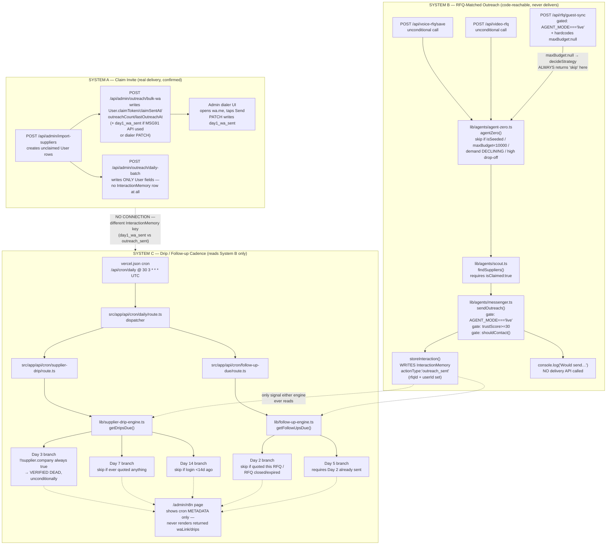

# VS-OUTREACH-CADENCE-TRUTH-AUDIT-01

**Date:** 2026-09-03
**Purpose:** independently verify `docs/audits/VS-FOUNDER-LAUNCH-REALITY-CHECK-01.md`'s findings on the supplier outreach follow-up system.
**Scope:** production only. Every file below was read via `git show origin/main:<path>` against the commit confirmed as the last successful production deployment (`a6390fb3`), re-confirmed fresh via `git fetch origin main` at the start of this session. No working-tree file, no other branch, is used as evidence — where mentioned, it's only to note exclusion.
**Rule followed:** every claim is anchored to a file, a line, and a reproduced excerpt. No inference presented without the code that supports it.
**Read-only.** No code changed. Nothing committed. Nothing pushed. Nothing deployed.

---

## 1. The complete supplier outreach lifecycle, as it actually exists in production

There are **three structurally separate systems** sharing the same `InteractionMemory` table but never reading each other's rows. This is the single most important fact this audit establishes — everything else follows from it.

```
SYSTEM A — Claim Invite (real, delivers)
  Import → bulk-wa / daily-batch → User.lastOutreachAt / outreachCount / claimToken (+ day1_wa_sent, bulk-wa only)
  No automated follow-up exists on top of this system at all.

SYSTEM B — RFQ-Matched Outreach (code-reachable, never delivers)
  Voice/Video RFQ create → agentZero → scout → messenger → InteractionMemory.outreach_sent
  This is the ONLY writer the Day 2/3/5/7/14 cadence (System C) reads from.

SYSTEM C — Drip / Follow-up Cadence (reads System B's signal only)
  Vercel cron → supplier-drip-engine.ts (Day 3/7/14) + follow-up-engine.ts (Day 2/5)
  → queries InteractionMemory.outreach_sent → generates wa.me links → returns JSON, delivers nothing itself
```

Systems A and B/C do not interact. A supplier invited via the dialer or bulk-send (System A, real delivery) will **never** enter the Day 3/5/7/14 cadence (System C), because System C only ever looks for `outreach_sent` rows, and System A never writes that key — it writes `day1_wa_sent` and `User.lastOutreachAt` instead. This is proven, not inferred — see §2.

---

## 2. Every location where each item is written, updated, or consumed

### `outreach_sent`

| File:line | Op | Excerpt |
|---|---|---|
| `lib/agents/messenger.ts:75` | **Read** | inside `shouldContact()`: `prisma.interactionMemory.findFirst({ where: { rfqId, userId: supplierId, actionType: 'outreach_sent', createdAt: {...} } })` |
| `lib/agents/messenger.ts:125` | **WRITE — the only one in the repository** | inside `sendOutreach()`: `storeInteraction({ rfqId: rfq.id, userId: supplier.id, actionType: 'outreach_sent', source: 'whatsapp', metadata: {...} })` |
| `lib/supplier-drip-engine.ts` (~line 82, in `getDripsDue()`) | **Read** | `prisma.interactionMemory.findMany({ where: { actionType: 'outreach_sent', createdAt: {...}, userId: {not:null} } })` |
| `lib/follow-up-engine.ts` (~line 87, in `getFollowUpsDue()`) | **Read** | `prisma.interactionMemory.findMany({ where: { actionType: 'outreach_sent', createdAt: {...}, rfqId: {not:null}, userId: {not:null} } })` |
| `src/app/api/admin/outreach-stats/route.ts:14,79,108` | **Read (analytics)** | own comment: `'outreach_sent', // legacy key — kept for backward compat; may have 0 rows` |
| `src/app/api/admin/launch-metrics/route.ts:40,74` | **Read (analytics)** | counts alongside `subscription_activated`, `whatsapp_click` |
| `src/app/api/metrics/funnel/route.ts:42` | **Read (analytics)** | funnel-stage count |
| `src/app/admin/outreach/page.tsx:15,26,708,732` | **Read (display label only)** | UI label mapping, not a query |
| `lib/knowledge-base.ts:279` | **Not code** | a documentation string inside a static content array |

**Exhaustive** — `git grep -n "outreach_sent" origin/main -- '*.ts' '*.tsx'` returns exactly these 7 files, no others.

### `contactedAt`

| File:line | Op |
|---|---|
| `lib/follow-up-engine.ts:144` | **Local variable only** — `const contactedAt = c.createdAt.getTime();`, immediately reused at lines 145-146 for window comparisons |

Not a schema field. Not a `User` column. Not persisted anywhere. It is a name given to a value derived, at query time, from an `InteractionMemory.createdAt` timestamp — scoped entirely inside `getFollowUpsDue()`, discarded on return.

### `lastContactedAt`

**Zero matches**, whole repository, both `.ts` and `.tsx`. This identifier does not exist in this codebase under this exact name.

### `followUpStage`

**Zero matches**, whole repository. Does not exist under this exact name. (The closest real concepts are the `FollowUpType`/`DripType` TypeScript union types — `'day2'|'day5'` and `'day3'|'day7'|'day14'` — which are parameters, not a persisted "stage" field on any model.)

### `lastOutreachAt` (the real, persisted "last contact" state — included because it's what the task's "contactedAt"/"lastContactedAt" concepts actually map to in this codebase)

| File:line | Op |
|---|---|
| `prisma/schema.prisma:37` | Schema — `User.lastOutreachAt DateTime? @map("last_outreach_at")` |
| `src/app/api/admin/outreach/bulk-wa/route.ts:84-85` | **Read** — eligibility filter (`null` or older than 2 days) |
| `src/app/api/admin/outreach/bulk-wa/route.ts:140` | **WRITE** — `lastOutreachAt: new Date()` on send |
| `src/app/api/admin/outreach/daily-batch/route.ts:22-23` | **Read** — same eligibility filter |
| `src/app/api/admin/outreach/daily-batch/route.ts:77` | **WRITE** — `lastOutreachAt: new Date()` |
| `src/app/api/admin/outreach/stats/route.ts:22` | **Read** — "contacted today" count |

This field belongs entirely to **System A** and is never read by `supplier-drip-engine.ts` or `follow-up-engine.ts`.

### "Supplier drip"

Implemented as `lib/supplier-drip-engine.ts` (`getDripsDue()` / `logDripSent()`), invoked from `src/app/api/cron/supplier-drip/route.ts`. Writes/reads the action-type family `drip_day3_sent` / `drip_day7_sent` / `drip_day14_sent` (confirmed exhaustively: `lib/supplier-drip-engine.ts` lines 106,146,153,158,172-174; consumed for analytics-only in `src/app/api/admin/outreach-stats/route.ts` lines 17-19,82-84,111-113 and `src/app/api/metrics/funnel/route.ts:48`).

### "Outreach cadence"

Not a single named construct — it is the composite of System A's 2-day cold-outreach re-eligibility window (`lastOutreachAt`) and System C's Day 2/3/5/7/14 windows (`follow-up-engine.ts`/`supplier-drip-engine.ts`, both keyed off `outreach_sent`). No unified "cadence" object, table, or state machine exists; each engine computes its own windows independently from raw timestamps at query time.

---

## 3. Dependency graph — import → invitation → outreach → Day 3 → Day 5 → Day 7 → Day 14



**Read the dotted line between System A and System C literally** — it does not exist in the code; it is drawn here only to make explicit that no such connection was found despite being the intuitively expected one (real outreach → real follow-up).

---

## 4. Does any production route/cron/scheduler/worker/API/queue/automation invoke `lib/agents/messenger.ts`?

**Yes — confirmed, one call chain, fully traced:**

```
lib/agents/messenger.ts  exports sendOutreach()
  ← imported by lib/agents/agent-zero.ts:18   ("import { sendOutreach } from './messenger';")
      called at lib/agents/agent-zero.ts:194  ("const messageResults = await sendOutreach(ctx, suppliers)...")
      ← agentZero() imported by:
          src/app/api/voice-rfq/save/route.ts:6   — called unconditionally, line ~108, fire-and-forget
          src/app/api/video-rfq/route.ts:4        — called unconditionally, line ~290, fire-and-forget
          src/app/api/rfq/guest-sync/route.ts:4   — called only if AGENT_MODE==='live' at the call site (line 47),
                                                      but structurally can never reach sendOutreach anyway (§1, §3 — hardcoded maxBudget:null)
```

Confirmed by `git grep -n "agents/messenger" origin/main -- '*.ts' '*.tsx'` → exactly one non-archive match (`lib/agents/agent-zero.ts:18`), and by `git grep -n "agents/agent-zero" origin/main -- '*.ts' '*.tsx'` → exactly three non-archive matches (the three routes above). No cron, scheduler, worker, or queue anywhere in the repository imports `agent-zero.ts` or `messenger.ts` directly — only these three HTTP API routes.

**This does not mean the delivery step works** — see §1/§6: `sendOutreach()`'s body never calls a WhatsApp send API in any branch; it only writes the `outreach_sent` row and `console.log`s what it "would" send.

## 5. Does any production route/cron/scheduler/worker/API/queue/automation invoke `src/lib/agents/messenger.ts`?

**No — because this file does not exist.**

```
git cat-file -e "origin/main:src/lib/agents/messenger.ts"  →  fails (object does not exist)
```

Confirmed against `origin/main` directly. Unlike `supplier-drip-engine.ts` and `follow-up-engine.ts` (which both exist twice — once live at repo-root `lib/`, once dead at `src/lib/`), `messenger.ts` has no duplicate at the `src/lib/` path, in production or in the working tree. There is nothing to invoke and nothing to prove non-invocation of beyond the file's non-existence.

---

## 6. Dead code, orphan code, duplicate implementations, unreachable paths

| Path | Classification | Evidence |
|---|---|---|
| `src/lib/supplier-drip-engine.ts` | **Duplicate, dead** | Exists in the working tree, does not exist in `origin/main`. Even where it does exist (working tree only, out of this audit's scope), nothing imports `@/src/lib/supplier-drip-engine` — every cron route imports `@/lib/supplier-drip-engine` (root), confirmed by `grep "^import" src/app/api/cron/supplier-drip/route.ts` |
| `src/lib/follow-up-engine.ts` | **Duplicate, dead** | Same pattern — working-tree-only, unimported by the live `@/lib/follow-up-engine`-importing cron route |
| `_archive/**` (multiple `sendOutreach`-named functions) | **Archived, excluded from build** | `tsconfig.json`'s `exclude` list explicitly removes `_archive`/`_archive/**`/`**/_archive/**` from compilation — confirmed not part of the deployed app regardless of content |
| `src/app/api/admin/outreach/daily-batch/route.ts` | **Not dead, but a disconnected silo** | Real, callable, writes real `User.lastOutreachAt`/`outreachCount`/`claimToken` — but writes **zero** `InteractionMemory` rows (`grep -n "interactionMemory\|storeInteraction" ...` → no matches, only one `prisma.user.update`). Its sends are invisible to both `outreach-stats`' `day1_wa_sent` counting and to System C's `outreach_sent` selection. A third, fully isolated generator alongside `bulk-wa` |
| Day 3 branch, `lib/supplier-drip-engine.ts` | **Unreachable path, proven** | `const profileComplete = !!supplier.company; if (profileComplete) continue;` — every supplier `scout.ts`'s `findSuppliers()` can ever surface requires `isClaimed: true`; `company` is required and populated at import time (`import-suppliers/route.ts`) and never cleared by claiming. `profileComplete` is `true` for 100% of real candidates. This branch cannot select a candidate under any production data state |
| `guest-sync`'s `agentZero()` call | **Unreachable path, structural** | Hardcodes `maxBudget: null`; `decideStrategy()`'s first check (`!ctx.maxBudget → skip`) fires unconditionally before any other logic runs. This specific call site can never reach `sendOutreach()`, independent of `AGENT_MODE` or any DB state |
| `lib/agents/messenger.ts`'s delivery step | **Stub, not dead, not wired** | Reachable and executed when its gates pass, but its own body never calls an external send API — `console.log` only, by design per its inline comment ("For now: log to console + InteractionMemory") |
| `src/app/admin/n8n/page.tsx` | **Orphaned display gap** | The only admin page referencing `/api/cron/supplier-drip` or `/api/cron/follow-up-due` — renders only `name`/`schedule`/`description` metadata for each; confirmed via `grep -n "waLink\|drips\|\.map("` returning no rendering of either response field. Any candidate either cron generates has no UI path to a human |

---

## 7. Verdict

Per-component (necessary to state precisely before rolling up, since the three systems behave differently):

- **System A (claim invite via `bulk-wa`/dialer):** READY. Real writes, real delivery mechanism, confirmed working. **Not itself a follow-up system** — it has no automated cadence layered on top of it.
- **`daily-batch`:** PARTIALLY READY — functions, but produces no trackable record any dashboard or downstream system reads.
- **System B (RFQ-matched outreach, `agentZero`→`scout`→`messenger`):** BROKEN. Reachable, gate-checked correctly, but its own "send" step is a stub that delivers nothing in any configuration.
- **System C, Day 3 specifically:** DEAD CODE (in the precise sense of "code that executes but can never produce its intended effect" — not "unimported," but functionally identical to unreachable, proven by the `!!supplier.company` analysis above, independent of everything else in this report).
- **System C, Day 2 / 5 / 7 / 14:** BROKEN. The selection logic itself has no proven defect and would correctly identify candidates — but it depends entirely on System B's `outreach_sent` signal (itself gated behind an unverifiable production `AGENT_MODE` flag and structurally decoupled from any real supplier contact), and even a successfully-generated candidate has no UI path to a human (§6, `n8n` page).

**Overall verdict for "the supplier follow-up system" (Day 3/5/7/14, the subject of the claim this audit was asked to verify): BROKEN.**

Not **READY** — no evidence exists, or could exist from source alone, that it has ever delivered a real Day 3/5/7/14 message, and one branch (Day 3) is proven incapable of ever doing so regardless of data state.

Not **PARTIALLY READY** — that label would fit if, say, the cron ran correctly but delivery required a manual step (as System A's dialer legitimately is). Here the defect is structural and stacked: the trigger signal it depends on is fed by a feature (voice/video RFQ creation) that has nothing to do with "we contacted a supplier," gated by a production variable this audit cannot confirm, and even success at every gate produces no real message and no operator-visible result.

Not **DEAD CODE** in the literal sense the task distinguishes it from — `lib/agents/messenger.ts` and the cron chain **are** invoked by real production traffic (§4), unlike the genuinely unimported `src/lib/*` duplicates (§6). Reserving "DEAD CODE" for those files keeps the distinction the task asks for meaningful: **unreachable-by-import** (the `src/lib/` duplicates, and the Day 3 branch specifically) versus **reachable-but-non-functional** (the rest of System B/C).

---

## UNTRACKED / UNSTAGED / UNCOMMITTED

Current branch: `fix/admin-audit-phase1-4`, 4 commits ahead of `origin/main` / 0 behind (unchanged across every report in this series; reconfirmed via `git fetch origin main` at the start of this session). `git status --porcelain` carries forward the same pre-existing 21 modified + ~65 untracked entries noted in every prior report, plus this report's own new file and the three prior reports' files (`VS-FOUNDER-READINESS-REALITY-AUDIT-01.md`, `VS-FOUNDER-LAUNCH-REALITY-CHECK-01.md`, `VS-OUTREACH-SIGNAL-TRUTH-01.md`) — all left untracked, nothing staged, nothing committed, nothing pushed, per instruction.
